# EpiTrack pipeline

## General information

This suite was developped to facilitate the development of T-Cell-centric SARS-CoV-2 vaccines by enabling the geo-temporal monitoring of the diversification of SARS-CoV-2 T cell epitopes. This is done by levaraging the vast array of SARS-CoV-2-specific genomic data provided by GISAID. Together, the tools available here can:
-	 Temporally monitor the diversification of selected T cell epitopes and assess the prevalence of top alternative epitopes 
-	 Perform an in-depth analysis of the top lineages/Variants Of Concerns (VOCs) responsible for the diversification of selected epitopes
-	 enable the geo-temporal visualization of peptide diversification.

#### External dependencies:
-	 pandas 
-	 seaborn & matplotlib
-	 numpy
-	 geopandas
-  sys
-  os

#### Required dataset download:
This toolkit is built around the GISAID SARS-COV-2 genomic alignment file. In order to run the script, users must download the codon-based alignment of sequences from GISAID (named MSAcodonXXXX, where XXXX refers to the build ID) as well as its corresponding metadata, and merge them. Entries with incomplete year/month dates, as well as entries with non-human hosts should be removed. While many informations are available with the metadata, the metadata information crucial to the tools described below are the date, continent, country, and pango-lineage.

## Instructions:
## General instructions:
Prior to running the tools described below, users should modify the indicated lines of the masterscipt, EpiTrack.sh.
Specifically, the following variables should be provided:

-  FOLDER: full path to the directory containing all EpiTrack files
-  DATASET_LATEST_BUILD_FOLDER: full path to the directory where the original data files (such as the GISAID dataset, or the example Virusseq dataset provided in this GITHUB) should be stored
-  DATASET_LATEST_BUILD_FILENAME: name of the file featuring the original data msa + metadate
-  ORIGINAL_FILE: full path to the directory where the peptide specific files are stored (following processing by the Generating_Peptide_Files.sh script)
-  WORKING_DIRCT: full path to the directory where the EpiTrack suite is being run

## Extraction of peptide data
This function will access the complete GISAID dataset (full MSA and metadata), extract MSA positions corresponding to the provided peptides of interest, and store the peptide-specific MSA + metadata files in folders named after the peptides of interest. peptide-specific folders will be stored within a folder named ExtractedPeptide, found within the same directory where the full GISAID msa + metadata file is stored.

### Preset Inputs (set in EpiTrack.sh script): 
-	 FOLDER: full path to folder containing EpiTrack scripts
-  DATASET_LATEST_BUILD_FOLDER: full path to directory where latest GISAID build is stored
-  DATASET_LATEST_BUILD_FILENAME: name of file with complete GISAID msa + metadata dataset

### commandline inputs:
-	 -o | --Output_File: Name of folder where results are to be stored. It will be found in the DATASET_LATEST_BUILD_FOLDER
-  -l | --PeptideList: list of peptides (no commas, in quotation marks) separated by space. Ex: "KLPDDFTGC TLNDLNETL NAPRITFGGP VPYNMRVI..."

### Suggested command:
./EPITRACK.sh -s ExtractPeptide_annotated.sh -l KLPDDFTGC TLNDLNETL NAPRITFGGP VPYNMRVI...

## Pandemic Specific Conservation

This function assesses the overall level of diversification of input peptides when compared to a control consisting of end-to-end 9mers spanning the complete SARS-COV-2 proteome.

### Preset Inputs (set in EpiTrack.sh script): 
-	 ORIGINAL_FILE: full path to epitope-specific GISAID msa and metadata
-	 FOLDER: full path to folder containing EpiTrack scripts
-  WORKING_DIRCT: full path to current working directory

### commandline inputs:
-	 -o | --Output_File: Name of folder where results are to be stored. This folder will be saved in the working directory.
-  -l | --PeptideList: list of peptides (no commas, in quotation marks) separated by space. Ex: "KLPDDFTGC TLNDLNETL NAPRITFGGP VPYNMRVI..."

### Suggested command: 
./EPITRACK.sh --script Pandemic_Specific_Conservation.sh -o RESULTS_PANDEMIC_SPECIFIC_CONSERVATION

### Output:
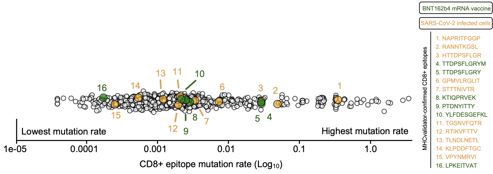

## Alternative peptide tracker

This function temporally monitors the diversification of selected T cell epitopes and assesses the prevalence of top alternative epitopes.

### Preset Inputs (set in EpiTrack.sh script): 
-	 ORIGINAL_FILE: full path to epitope-specific GISAID msa and metadata
-	 FOLDER: full path to folder containing EpiTrack scripts
-  WORKING_DIRCT: full path to current working directory

### commandline inputs:
-	 -z | -zoomed: no to vizualize full breadth of alternative and wild-type peptides; yes to view bottom 20% of alternative epitopes
-	 -o | --Output_File: Name of folder where results are to be stored. This folder will be saved in the working directory.

### Suggested command: 
./EPITRACK.sh --script Alternative_peptide_tracker.sh -z yes -o RESULTS_ALTERNATIVE_PEPTIDES

### Output:
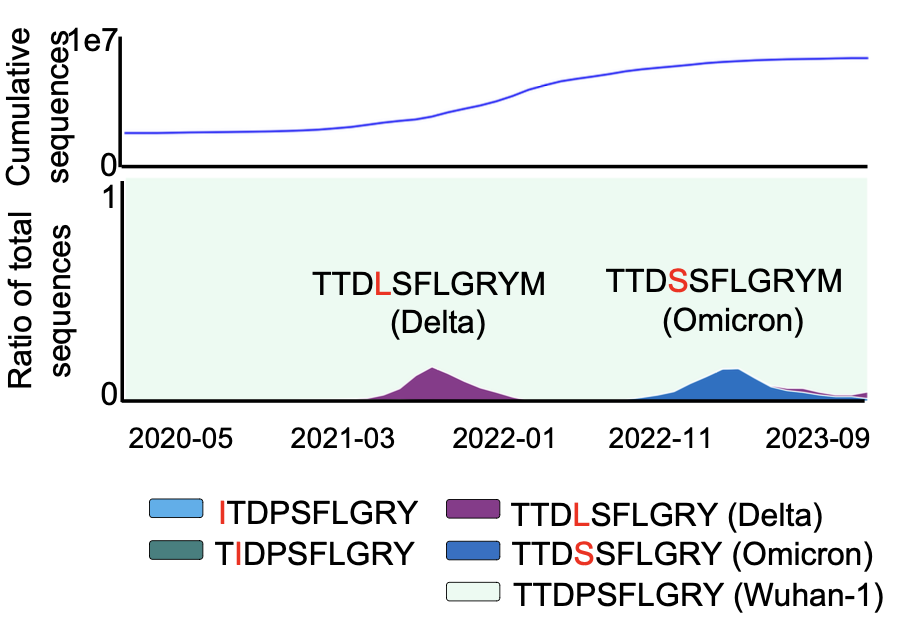

## Peptide Lineage Tracker
This function performs an in-depth analysis of the top lineages/Variants Of Concerns (VOCs) responsible for the diversification of selected epitopes

### Preset Inputs (set in EpiTrack.sh script): 
-	 ORIGINAL_FILE: full path to epitope-specific GISAID msa and metadata
-	 FOLDER: full path to folder containing EpiTrack scripts
-  WORKING_DIRCT: full path to current working directory

### commandline inputs:
-	 -o | --Output_File: Name of folder where results are to be stored. This folder will be saved in the working directory.

### suggested command: 
./EPITRACK.sh --script Alternative_peptide_tracker.sh -o RESULTS_LINEAGE_TRACKING

### Output:
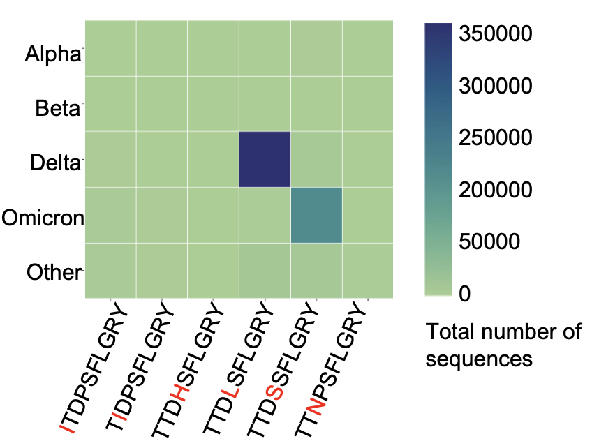

## Peptide Map Generator
This function enable the geo-temporal visualization of peptide diversification.

### Preset Inputs (set in EpiTrack.sh script): 
-	 ORIGINAL_FILE: full path to epitope-specific GISAID msa and metadata
-	 FOLDER: full path to folder containing EpiTrack scripts
-  WORKING_DIRCT: full path to current working directory

### commandline inputs:
-  -g | --Geography: Region to visualize. "Worldwide" provides complete world map; "Europe", "Asia", "Africa", "NorthAmerica", "Oceania", "SouthAmerica" visualize these regions, respectively; 
-  -p | --Peptide_Specific: no to analyse all alternative epitopes for every single epitope given; If yes, provide sequence of alternative peptide followed by its unmutated counterpart for the command -p; example: "NALRITFGGP,NAPRITFGGP"
       ****** The Peptide_Specific function will only work if there is more than one alternative peptide ********
-	 -o | --Output_File: Name of folder where results are to be stored. This folder will be saved in the working directory.

### suggested command:
All alternative peptides:
./EPITRACK.sh --script Peptide_Map_Generator.sh -g Worldwide -p no -o RESULTS_MAP

Specific alternative peptide (Example NALRITFGGP, alternative peptide of NAPRITFGGP):
./EPITRACK.sh --script Peptide_Map_Generator.sh -g Worldwide -p "NALRITFGGP,NAPRITFGGP" -o RESULTS_MAP

### Output:
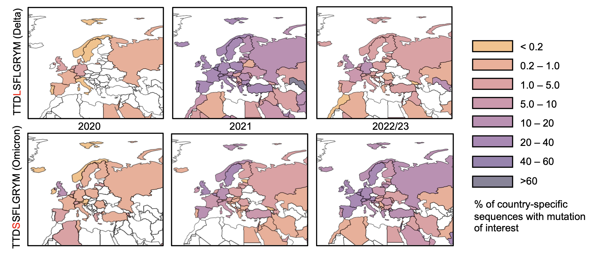

## Junction driven non-Canonical epitopes
This function enables the analysis of pre-processed NCBI SARS-CoV-2 sequencing libraries in order to identify deletions leading to LPYPQILLL (+1 frameshift).

### Preset Inputs (set in EpiTrack.sh script): 
-	 ORIGINAL_FILE: full path to epitope-specific GISAID msa and metadata
-	 FOLDER: full path to folder containing EpiTrack scripts
-  WORKING_DIRCT: full path to current working directory
-  File containing the full list of deletions in the region spanning the genomic positions 23,623 and 23,693. The file should have the following format, consisting of three columns (Pos, Del, Sample) corresponding to the start position of the deletion, the deletion information (number of reads|deletion sequence) and the library ID, respectively. An example is given below:

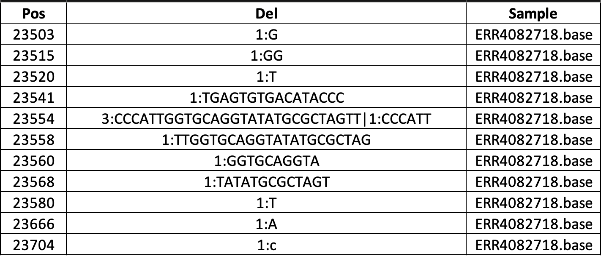

An example is provided in the script directory of this github (All_Data_Multiprocessed_Three_waves_DelAbove1_LongInterval.csv.gz). However, it is compressed (.gz), and must therefore uncompressed with the following command:
 --> gunzip All_Data_Multiprocessed_Three_waves_DelAbove1_LongInterval.csv.gz

### commandline inputs:
-	-o | --Output_File: Name of folder where results are to be stored. This folder will be saved in the working directory.

### suggested command:
./EPITRACK.sh --script Junction_driven_nonCanonical_epitopes.sh -o Figures

### Output:
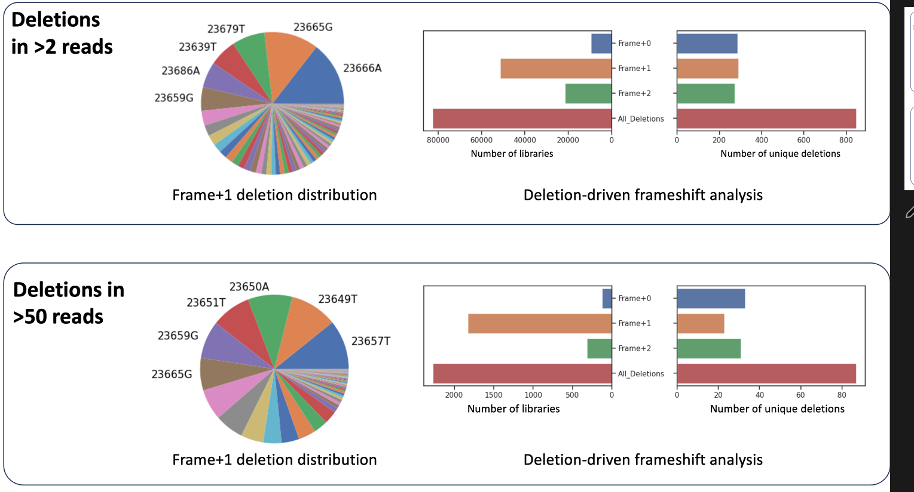

# EXAMPLE DATASET AND RESULTS FOR GENERAL USE
## Example dataset
The dataset utilized to generate the analyses was very large (>400GB), and consisted on the complete GISAID SARS-CoV-2-specific dataset as of October 2023 (14.6 million SARS-CoV-2 sequences). While users may download that dataset and follow the instructions above to replicate all analyses shown (also found in the associated manuscript) given appropriate GISAID access, the EPITRACK tool can be used on any dataset containing the following information:
- Viral sequence (all analyses)
- Virus collection date (Alternative peptide tracker; Peptide Map Generator)
- Sample geographical origin (Continent, Country) (Peptide Map Generator)

To allow users to run the script, we provide an small example dataset, named "VirusSeq_SubSampling5548.data", consisting of 5,548 viral sequences acquired from the Canada-hosted, open-source, data-sharing platform Virusseq (https://virusseq-dataportal.ca/). The example given pertains to samples specific to canada, and contains Viral Sequences, collection dates, and sample continent/country of origin. This example dataset is compressed for storage purposes, and must therefore be uncompressed prior to analysis with EpiTrack. This can be done by going into the "Virusseq_Example_data" directory and running the following command:
gunzip VirusSeq_SubSampling5548.data

## Analyzing the example dataset with EpiTrack
Ensure that the directories found at the top of the EPITRACK.sh script (above the "DO NOT CHANGE CODE BELOW THIS LINE" indication) are set to their respective directories, as indicated below:

-  FOLDER: full path to the directory containing all EpiTrack files
-  DATASET_LATEST_BUILD_FOLDER: full path to the directory where the example data file, titled VirusSeq_SubSampling5548.data, should be stored
-  DATASET_LATEST_BUILD_FILENAME: name of the example data file (VirusSeq_SubSampling5548.data)
-  ORIGINAL_FILE: full path to the directory where the peptide specific files are stored (following processing by the Generating_Peptide_Files.sh script)
-  WORKING_DIRCT: full path to the directory where the EpiTrack suite is being run

The example dataset can be then analyzed using EpiTrack by following the instructions above for each of the functions (see **Instructions** section above). Below are example commands for executing each of the functions on the dataset. In parantheses are the expected runtime for analyzing the example dataset on an average computer (runtimes will vary based on the size of the dataset).

## Expected results
## Extraction of peptide data 
To replicate the results obtained in this example, use the following command (**10-30 seconds per peptide**):
./EPITRACK.sh -s ExtractPeptide_annotated_Custom_output.sh -l "NAPRITFGGP SPRRARSVA" -o ExtractedPeptide_Virusseq

## Alternative peptide tracker
To replicate the results obtained in this example, use the following command (the -z command can be changed to yes to look at the bottom 20% of sequences) (**~1 minute**):
./EPITRACK.sh -s Alternative_peptide_tracker.sh -z no -o RESULTS_ALTERNATIVE_PEPTIDES

### Expected output
All sequences considered:
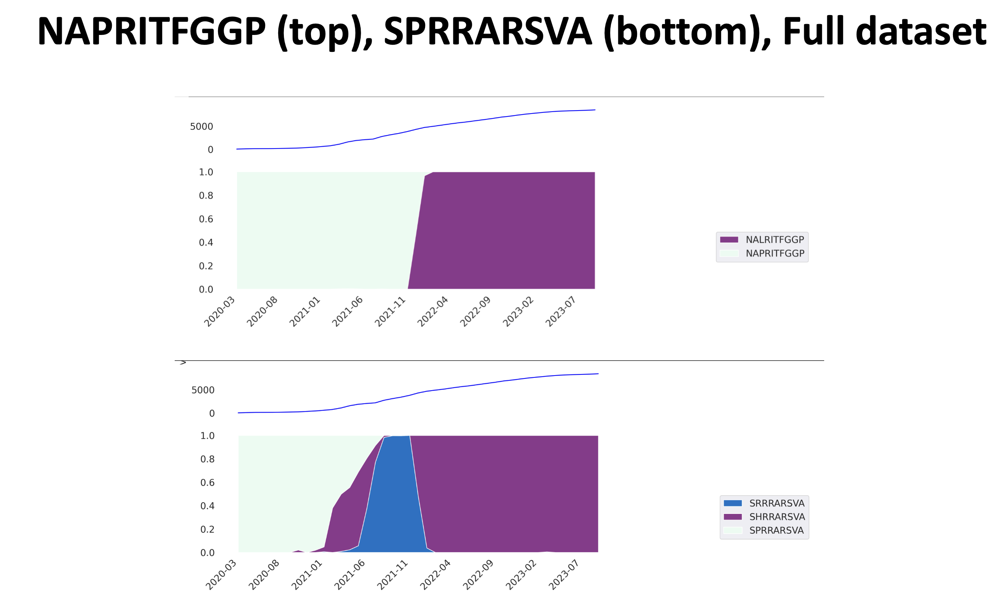

bottom 20% of sequences considered (-z yes option):
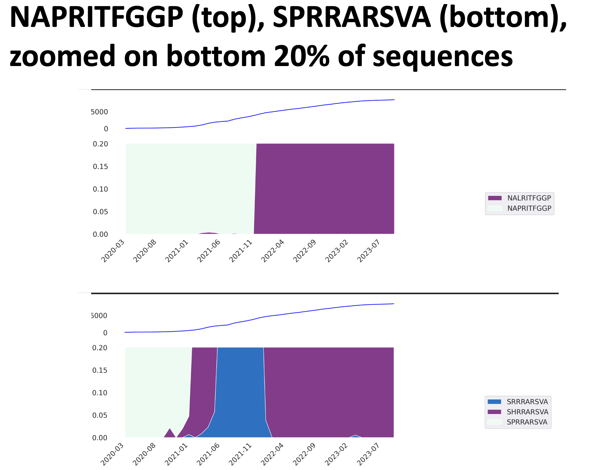

## Pandemic Specific Conservation
To replicate the results obtained in this example, use the following command (**~1 minute**):
./EPITRACK.sh -s Pandemic_Specific_Conservation.sh -o RESULTS_PANDEMIC_SPECIFIC_CONSERVATION

### Expected output
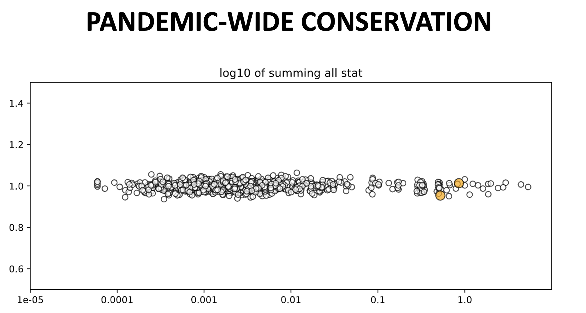

## Peptide Map Generator
To replicate the results obtained in this example, use the following command (**~1 minute**):
./EPITRACK.sh -s Peptide_Map_Generator.sh -g WorldWide -s -no -o RESULTS_MAP

### Expected output
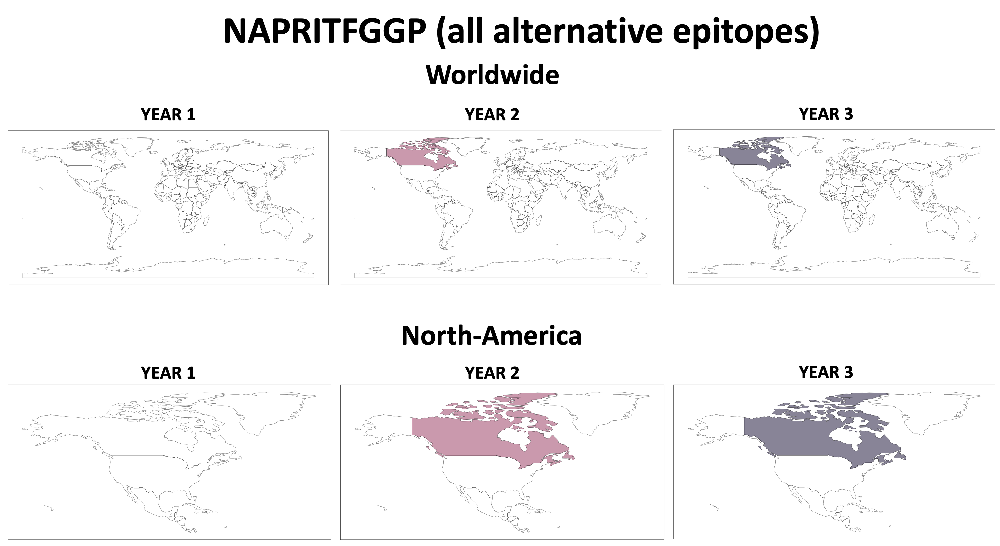

## Peptide Lineage Tracker
To replicate the results obtained in this example, use the following command (**~1 minute**):
./EPITRACK.sh -s Alternative_peptide_tracker.sh -o RESULTS_LINEAGE_TRACKING

### Expected output
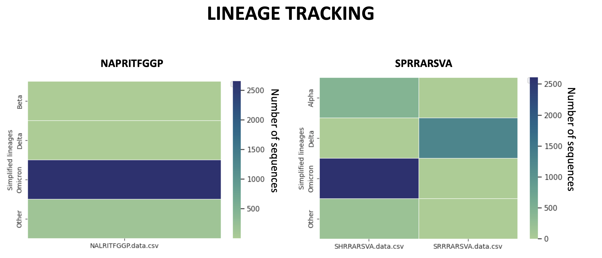

